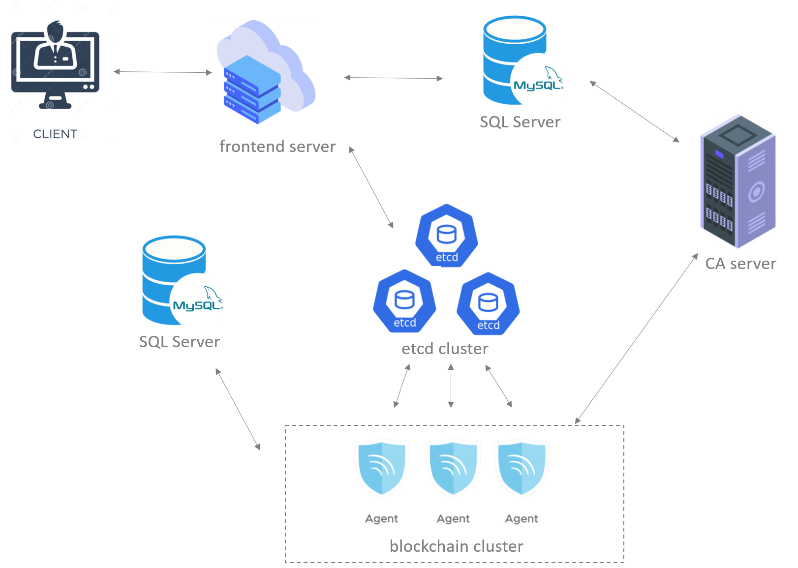

# 开发说明文档

fabric-manager服务整体分为六部分：server, agent, CA （Certificate Authority）, etcd, explorer, mysql。将就每一部分介绍功能逻辑

## 服务架构
架构如下图所示

fabric-manager整体来看是一个具备完整前后端的BaaS （Blockchain as a Service）平台。用户通过前端界面给后端server发送HTTP请求，来对区块链进行各项操作。server根据用户请求具体内容将消息加工后通过etcd发送给后端agent, agent以fabric命令的方式具体对区块链各节点进行操作。

## 服务功能

### 功能
- CreateOrg
创建区块链中的组织，本质是生成组织中各个成员的各类证书、密钥等。该命令通过向**CA**发送请求获取证书。所有证书将生成在`/root/fabric_networks/organizations/crypto/organizations`下。

- CreateCrypto
功能同`CreateOrg`相同，但是以fabric命令行工具`cryptogen`方式生成证书，无需与CA交互。提供该选项的原因是在后续开发中发现通过`CreateOrg`生成的证书有暂时无法解决的问题，而通过`cryptogen`生成则无此问题。

- CreateConsortium
创建联盟，联盟中的成员是第一步创建的各组织，同时要指定该联盟所需要的`orderer`。该命令本质是生成创世区块配置文件`genesis.yaml`, 并用fabric命令行工具`configtxgen`生成创世区块`genesis.block`。`genesis.yaml`中定义了该联盟的所有信息。

- StartConsortium
有了创世区块后即可启动区块链网络。具体包括各组织的`peer`,`orderer`,`cli`。本质是生成各成员的`docker-compose.yaml`

- CreateChannel
联盟启动后即可创建应用通道，该命令生成`configtx.yaml`,定义应用通道。

## server
项目代码在`server`目录下。
负责接受用户的各类HTTP请求，简单处理与转发。所有HTTP请求示例在`server/test/`下，处理HTTP请求的代码在`fabric-manager/server/routers/api`下。

## agent
项目代码在`agent`目录下。
负责接收server下发的各个命令执行来操作区块链。一般来讲，一台虚拟机对应一个agent对应一个区块链中的角色（orderer/peer）

## CA
通用的证书颁发机构，目前fabric-manager用的是fabric自带的fabric ca

## etcd
消息中间件，主要负责server喝agent的双向通信

## explorer
可视化整个区块链的web服务

## mysql
主要存储server从POST请求中获得的关键信息，如组织的证书、联盟信息等。